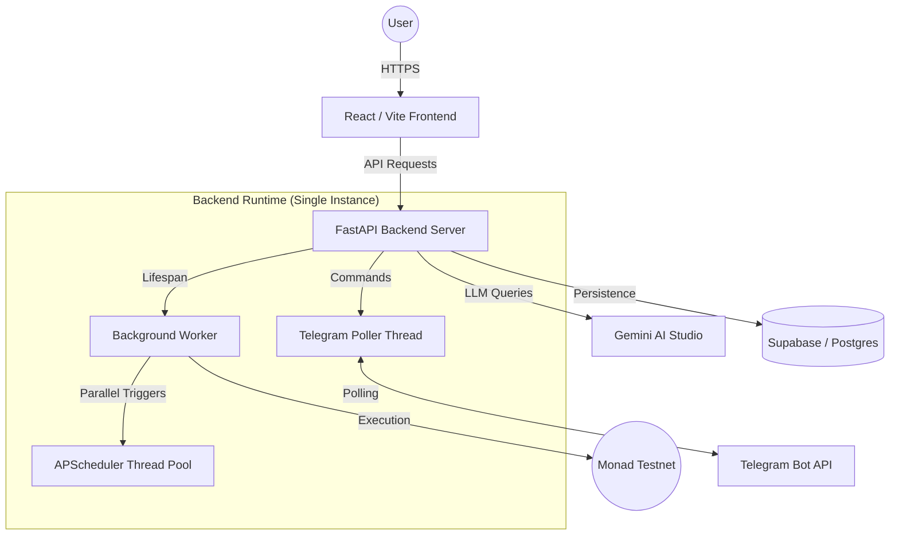

# AEGIS Deployment & Architecture Guide

This document outlines how to deploy the AEGIS platform to production and explains the underlying runtime architecture.

## 🏗 High-Level Architecture

AEGIS is designed as a **Single-Service Orchestrator** for simplicity and reliability.

## 🚀 Deployment Strategy (Render)

### 1. Backend Service (Web Service)
Deploy the `backend` folder as a **Web Service** on Render.

- **Environment**: Python
- **Build Command**: `pip install -r requirements.txt`
- **Start Command**: `uvicorn main:app --host 0.0.0.0 --port $PORT`
- **Required Env Vars**:
    - `GEMINI_API_KEY`: Your AI Studio key.
    - `STORE_BACKEND`: `supabase`
    - `SUPABASE_URL` & `SUPABASE_KEY`: Your project credentials.
    - `TELEGRAM_BOT_TOKEN`: Your bot token.
    - `EXECUTOR_PRIVATE_KEY`: Private key for the backend agent node.
    - `CLIENT_ORIGIN`: Your production frontend URL (e.g., `https://aegis.vercel.app`).

### 2. Frontend Service (Static Site)
Deploy the `frontend` folder to Vercel, Netlify, or Render Static Sites.

- **Build Command**: `npm run build`
- **Output Directory**: `dist`
- **Required Env Vars**:
    - `VITE_SUPABASE_URL`: Public Supabase URL.
    - `VITE_SUPABASE_ANON_KEY`: Public Anon Key.
    - `VITE_API_URL`: The URL of your deployed Backend Web Service.

---

## ⚙️ How the Runtime Works

### Continuous Processes
- **FastAPI API**: Always running to serve UI and Webhook requests.
- **Worker Poller**: Runs every 30s to check for balance changes or state-based triggers.
- **Telegram Poller**: Maintains a persistent `getUpdates` connection to Telegram.

### Parallel Execution
When multiple automations are triggered simultaneously:
1. The **Scheduler** identifies the target automations.
2. It assigns each execution task to a separate thread in its **Thread Pool**.
3. Actions (like token swaps or transfers) run in parallel without blocking the API or other automations.

## ✅ Health Verification
After deployment, visit `https://your-api.com/health` to verify all systems:
- `api`: "active"
- `worker`: "active"
- `scheduler`: "running"
- `telegram`: "connected"

---

## 🛠 Local Development
To run locally:
1. `cd frontend && npm run dev`
2. `cd backend && python main.py`
3. Check terminal logs to see the "🚀 AEGIS PLATFORM BOOTING..." report.
